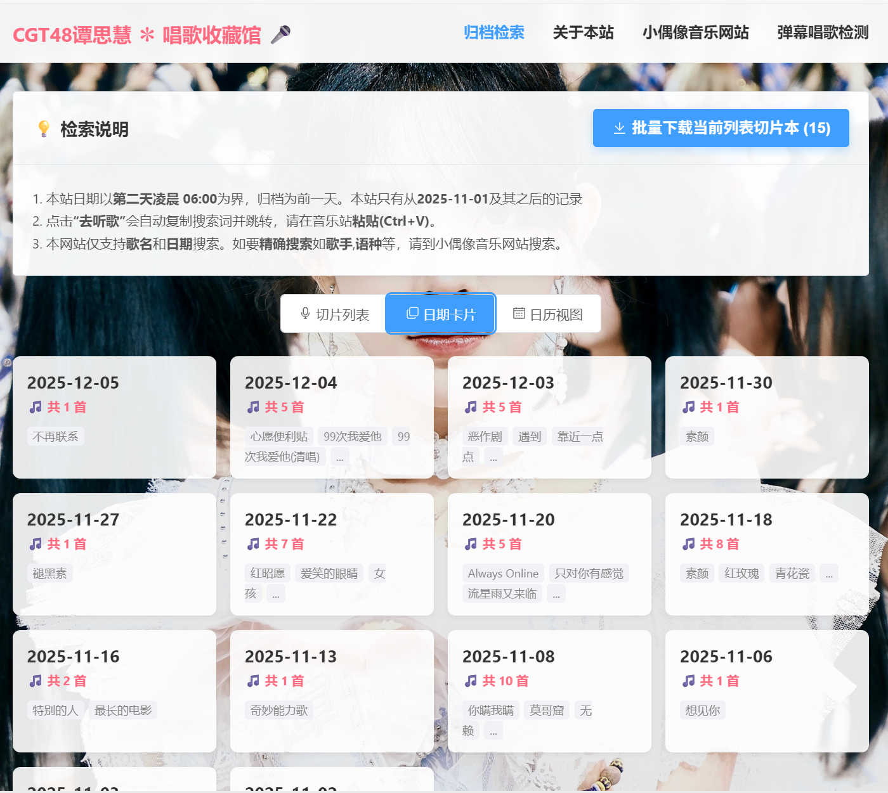

这份 README 写的已经很棒了！但我帮你把**最新开发的“Web版批量剪辑”功能**加进去了，并且更新了 **技术栈** 和 **Nginx 配置**（因为 `ffmpeg.wasm` 需要特殊的响应头，这一点在文档里体现非常重要）。

以下是重新润色并完善后的 README.md：

---

# 🎤 CGT48-谭思慧 唱歌切片收藏馆

<p align="center">
  <a href="https://tsh.abm48.com/">
    
  </a>
  <a href="https://gitee.com/albert-chen04/video-editing-toolkit">
    
  </a>
</p>

这是一个为 **CGT48 成员谭思慧** 建立的个人应援档案站。

项目核心是基于**直播唱歌切片文本记录**，自动生成一个可检索、可追溯、可下载的歌曲归档库。同时集成了**Web端在线批量剪辑工具**，让粉丝可以无需安装软件，直接在浏览器中利用切片本处理视频。

## 📸 界面预览

| 日期归档墙 | 切片检索与列表 | 在线批量剪辑 (Web版) |
| :---: | :---: | :---: |
|  |  |  |

## ✨ 核心功能

### 1. 🗂️ 归档与检索
*   **多视图浏览**: 提供 **“日历归档墙”** 和 **“瀑布流列表”** 两种模式，支持按日期快速回溯。
*   **毫秒级搜索**: 纯前端实现，支持输入 **歌名** 或 **日期** (如 `2025-12-08`) 实时过滤。
*   **双站联动**: 一键复制 `歌名+日期` 组合关键词，并自动跳转至 [小偶像音乐站](https://abm48.com)，实现“查到即听到”。

### 2. ✂️ 在线批量剪辑 (New!)
*   **零基础使用**: 这是一个移植自 [桌面版剪辑软件](https://gitee.com/albert-chen04/video-editing-toolkit) 的 Web 工具。
*   **纯本地运算**: 基于 **WebAssembly (FFmpeg.wasm)** 技术，所有剪辑在用户浏览器内完成，**无需上传视频**，保护隐私且速度极快。
*   **智能格式转换**: 支持导出 `MP4` (Copy流/极速)、`MP3` (自动转码)、`WAV` 等多种格式。
*   **一键打包**: 自动将剪好的片段和对应的记录文本打包成 `.zip` 下载。

### 3. 🔄 自动化数据流
*   **自动更新**: 服务器端配置了自动化脚本。只需上传 `.txt` 切片记录文件，网站数据会在 1 分钟内自动解析并更新，无需重新编译前端。
*   **批量下载**: 支持将搜索结果对应的源 `.txt` 文件批量打包下载。

## 🛠️ 技术栈

*   **核心框架**: Vue 3 + Vite
*   **UI 组件库**: Element Plus
*   **音视频处理**: **FFmpeg.wasm** (WebAssembly)
*   **数据脚本**: Node.js (服务端自动化解析生成 `data.json`)
*   **工具库**: JSZip (文件打包)

## 🚀 快速开始

### 本地开发

1.  **克隆项目**
    ```bash
    git clone [项目地址]
    cd tsh-fansite
    ```

2.  **安装依赖**
    ```bash
    npm install
    ```

3.  **准备数据**
    *   将切片记录 `.txt` 文件放入 `scripts/txt_source/` 目录。
    *   运行脚本生成数据：
    ```bash
    npm run gen
    ```

4.  **启动服务**
    ```bash
    npm run dev
    ```

## 📦 部署说明

本项目为纯静态网站，但为了支持 **FFmpeg.wasm** 的多线程特性，服务器 (**Nginx**) 必须配置特定的响应头 (COOP/COEP)。

### 推荐 Nginx 配置

```nginx
server {
    listen 80;
    server_name your-domain.com;
    root /www/wwwroot/your-project;
    index index.html;

    # 1. 核心：为所有 HTML/JS/CSS 添加跨域隔离头，否则 FFmpeg 无法启动
    add_header Cross-Origin-Opener-Policy same-origin always;
    add_header Cross-Origin-Embedder-Policy require-corp always;

    # 2. 正确处理 .wasm 文件类型
    location ~ \.wasm$ {
        default_type application/wasm;
    }

    # 3. 防止 Vue 路由刷新 404
    location / {
        try_files $uri $uri/ /index.html;
    }
}
```

### 自动化更新数据配置 (Linux/宝塔)

1.  在服务器安装 Node.js。
2.  设置计划任务（Cron Job），每分钟执行一次生成脚本：
    ```bash
    /path/to/node /www/wwwroot/your-project/scripts/gen-data.js
    ```
3.  只需通过 FTP 上传新的 TXT 文件，网站即可自动更新。

## 🔗 相关项目

*   **[Video Editing Toolkit](https://gitee.com/albert-chen04/video-editing-toolkit)**: 本站在线剪辑功能的 Python 桌面版原身，功能更强大。
*   **[Albert Music Frontend](https://abm48.com)**: 关联的音乐网站。
*   **[Singing Detector](https://gitee.com/albert-chen04/singing_detector)**: 弹幕唱歌检测工具。

## ❤️ 致谢

感谢谭思慧每天带来的动听歌声。